<h1 align="center">
  
  수다DUCK
</h1>

  <b>🏆 SSAFY 공통 프로젝트 우수상 수상</b>

 

  <b>친구들과 떠드는 즐거운 수다가</b> 
  <b>가장 강력한 영어 학습 스크립트가 되는 곳</b>

 

  일상 대화를 기반으로 AI가 분석하고 정리해주는 
  <b>Real-time Voice 기반 영어 회화 서비스</b>

 

  
  
  

 

  

## 🚀 프로젝트 정보

- 전체 프로젝트 기간 : 2026.01.06 ~ 2026.02.09 (약 5주)
- 플랫폼 : Web
- 개발 인원 : 6명
- 기관 : 삼성 청년 SW·AI 아카데미 SSAFY 14기

## Team

<table width="100%">
<tr>
<td align="center" width="33%" valign="top">

**김가민**  
Team Lead / Backend

프로젝트 총괄  
백엔드 API 개발 
Spring Security & JWT 인증/인가  
OAuth 2.0 (Kakao) 소셜 로그인  
Redis(Hash/Set) 기반 실시간 캐싱  
Redis ↔ MySQL 정합성 파이프라인  
DB 스키마 설계 및 JPA 최적화  
최종·본선 발표 전담  

</td>

<td align="center" width="33%" valign="top">

**장가은**  
Backend

프로젝트 일정 관리(Jira)  
백엔드 API 전반적인 개발  
대기방·게임방 상태 관리 로직 설계  
OpenVidu 기반 WebRTC 연동  
WebSocket(STOMP) 상태 동기화  
Redis 캐싱 설계 및 적용  
DB ERD 설계 및 데이터 모델링  
발표용 PPT 제작 및 기술 문서 정리  

</td>

<td align="center" width="33%" valign="top">

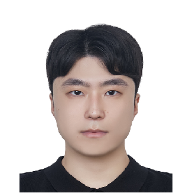

**이승엽**  
Infra

Docker 기반 Dev/Prod 환경 분리  
Jenkins + Blue-Green 무중단 배포 구축  
Mattermost Webhook 배포 알림 자동화  
방/세션 API 통합 리팩토링  
STOMP 기반 상태 동기화 UX 고도화  
예외 처리 및 세션 초기화 안정성 개선  

</td>
</tr>

<tr>
<td align="center" valign="top">

**전연수**  
Frontend

React/Vite 기반 퍼블리싱  
공통 레이아웃·컴포넌트 설계  
Axios 기반 API 연동 및 화면 처리  
기획 발표 자료 구성 및 발표  
UCC 기획·촬영·편집  

</td>

<td align="center" valign="top">

**최석원**  
Frontend

UI/UX 설계 및 React 구현  
WebSocket 기반 실시간 UI 처리  
음성 녹음 기능 및 사용자 흐름 제어  
공통 컴포넌트 구조 정리  
API 연동 및 상태 관리  

</td>

<td align="center" valign="top">

**최현웅**  
AI

AI 기능 전반 설계·개발  
비동기 음성 파이프라인(STT→전처리→GPT→TTS)  
Redis 기반 동시 입력 순서 보장  
GPT-4o-mini 기반 주제 추천·번역·퀴즈 생성  
실시간 돌발 퀴즈 및 발음 평가 시스템  

</td>
</tr>
</table>

 

## ✨ 주요 기능

<table width="100%">
  <tr>
    <td width="50%" align="center"><b>로그인</b></td>
    <td width="50%" align="center"><b>메인페이지</b></td>
  </tr>
  <tr>
    <td align="center">
      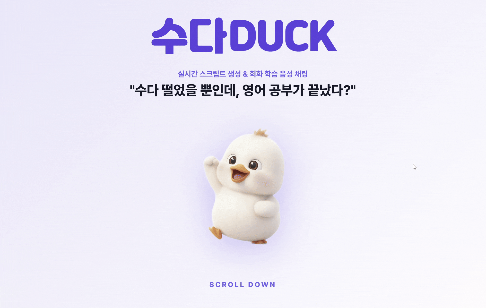
    </td>
    <td align="center">
      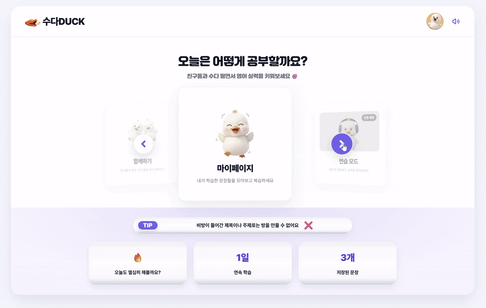
    </td>
  </tr>
</table>

 

<table width="100%">
  <tr>
    <td width="50%" align="center"><b>방 만들기</b></td>
    <td width="50%" align="center"><b>대기방 시작</b></td>
  </tr>
  <tr>
    <td align="center">
      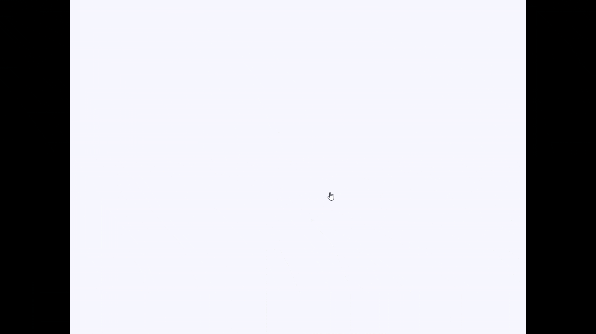
    </td>
    <td align="center">
      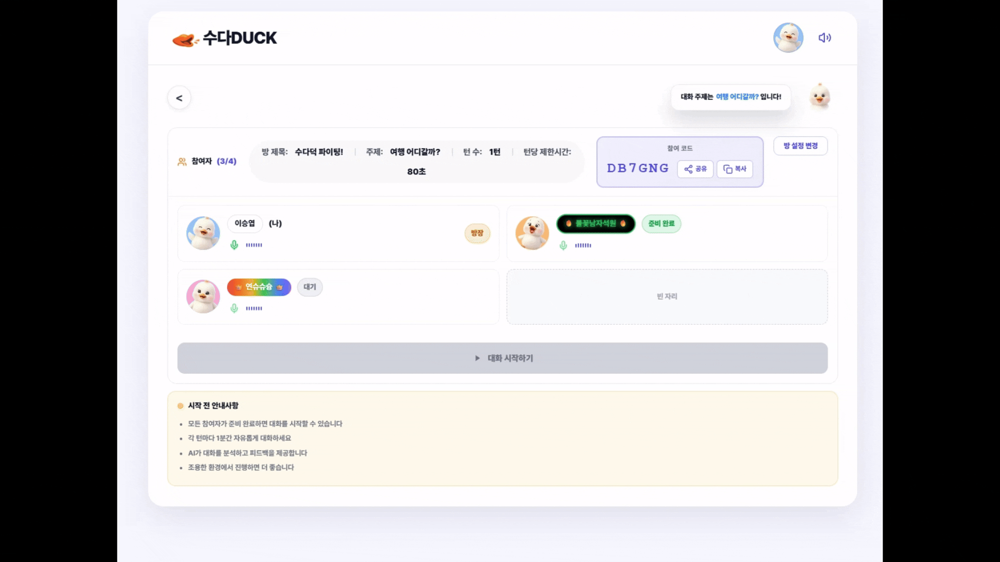
    </td>
  </tr>
</table>

 

<table width="100%">
  <tr>
    <td width="50%" align="center"><b>대화방</b></td>
    <td width="50%" align="center"><b>발음 평가 결과</b></td>
  </tr>
  <tr>
    <td align="center">
      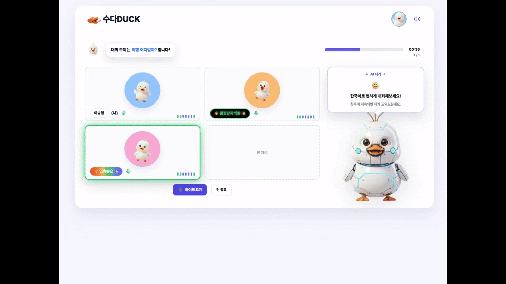
    </td>
    <td align="center">
      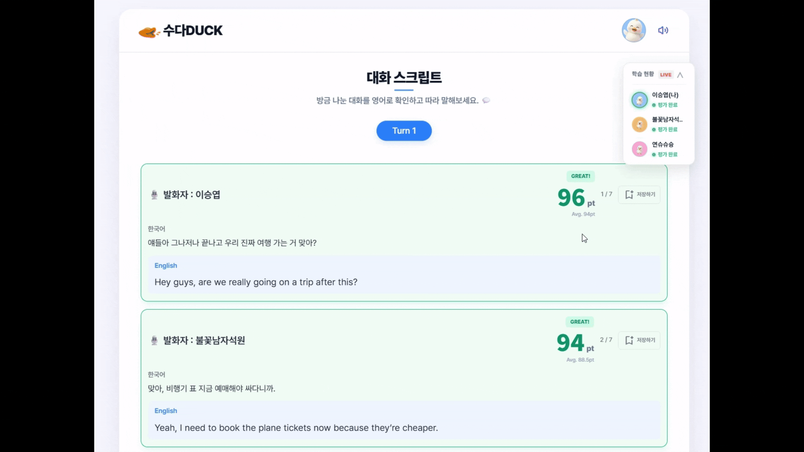
    </td>
  </tr>
</table>

 

<table width="100%">
  <tr>
    <td width="50%" align="center"><b>복습게임</b></td>
    <td width="50%" align="center"><b>복습게임리뷰</b></td>
  </tr>
  <tr>
    <td align="center">
      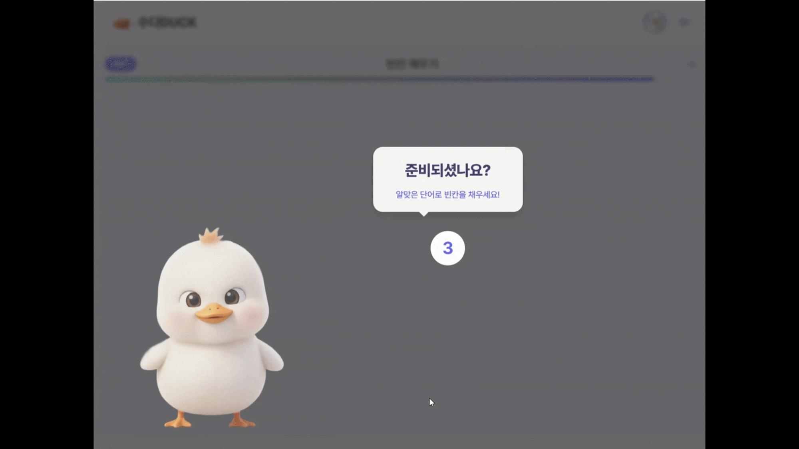
    </td>
    <td align="center">
      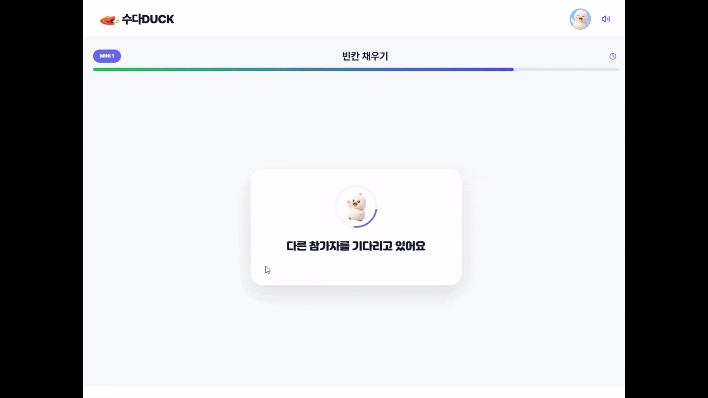
    </td>
  </tr>
</table>

 

<table width="100%">
  <tr>
    <td width="50%" align="center"><b>마이페이지</b></td>
    <td width="50%" align="center"><b>저장한 영어 문장</b></td>
  </tr>
  <tr>
    <td align="center">
      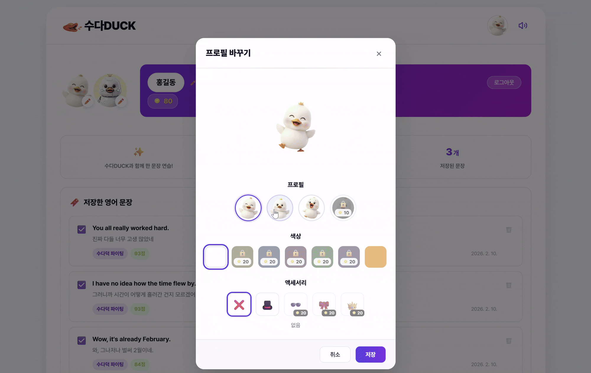
    </td>
    <td align="center">
      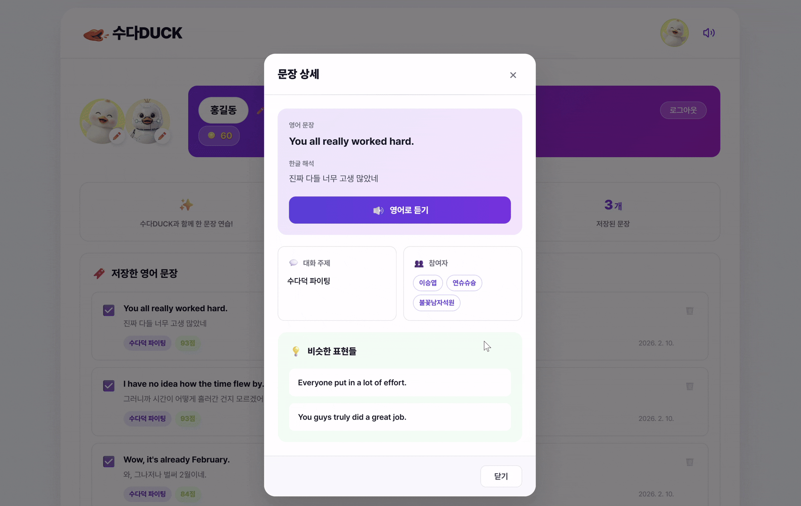
    </td>
  </tr>
</table>

  

## 🛠 기술 스택

### Frontend

  
  
  
  
  
  
  
  

 

| Category | Spec |
|:--:|:--|
| Language | JavaScript |
| Runtime | Node.js 24.12.0 |
| Framework | React 19.2.0, React Router 7.12.0 |
| Libraries | OpenVidu Browser 2.25.0, STOMP.js 7.2.1, SockJS 1.6.1, Axios 1.13.4 |
| Build Tool | Vite 7.2.4 |
| IDE | VS Code |

---

### Backend

  
  
  
  
  
  
  
  

 

| Category | Spec |
|:--:|:--|
| Language | Java 17 (Eclipse Temurin) |
| Framework | Spring Boot 3.5.9 |
| Core Libraries | Spring Security, JPA, Redis, OAuth2 Client, WebSocket, OpenVidu Java Client 2.25.0 |
| API Docs | Springdoc OpenAPI 2.3.0 |
| Database | MySQL 8.0.43, Redis (Alpine) |
| Build Tool | Gradle 8.14.3 |
| IDE | IntelliJ IDEA (Ultimate) |

---

### AI Integration

  
  
  
  

 

| Category | Spec |
|:--:|:--|
| LLM Model | GPT-4o mini |
| Speech | MS Cognitive Services Speech 1.47.0, OpenAI Whisper API |
| Features | 실시간 발음 평가, 비동기 음성 처리, 문법 교정 |

---

### DevOps

  
  
  
  
  
  
  

 

| Category | Spec |
|:--:|:--|
| Instance | AWS EC2 (Ubuntu 20.04 LTS) |
| Container | Docker Engine, Docker Compose v3.8 |
| CI/CD | Jenkins LTS (Docker-in-Docker) |
| Web Server | Nginx |
| Media Server | OpenVidu Server 2.25.0 (Pro / Host Network) |
| Notification | Mattermost Webhook |

---

### Collaboration Tools

 
 

---

## 📄 Project Documents

수다DUCK의 상세 기획 및 설계 문서는 아래에서 확인하실 수 있습니다.

 

<table width="100%">
  <tr>
    <td width="30%" align="center"><b>포팅 매뉴얼</b></td>
    <td width="70%" align="left">
      <a href="./exec/포팅메뉴얼.md">./exec/포팅메뉴얼.md</a>
    </td>
  </tr>
  <tr>
    <td align="center"><b>요구사항 명세서</b></td>
    <td align="left">
      <a href="https://www.notion.so/2e8826715e6280ce8f26cea5c674f82a?pvs=21">Notion 바로가기</a>
    </td>
  </tr>
  <tr>
    <td align="center"><b>API 명세서</b></td>
    <td align="left">
      <a href="https://www.notion.so/API-2ea826715e628000bcfadb7d9bd88d41?pvs=21">Notion 바로가기</a>
    </td>
  </tr>
</table>

  

---

## 🗃 Data Modeling

  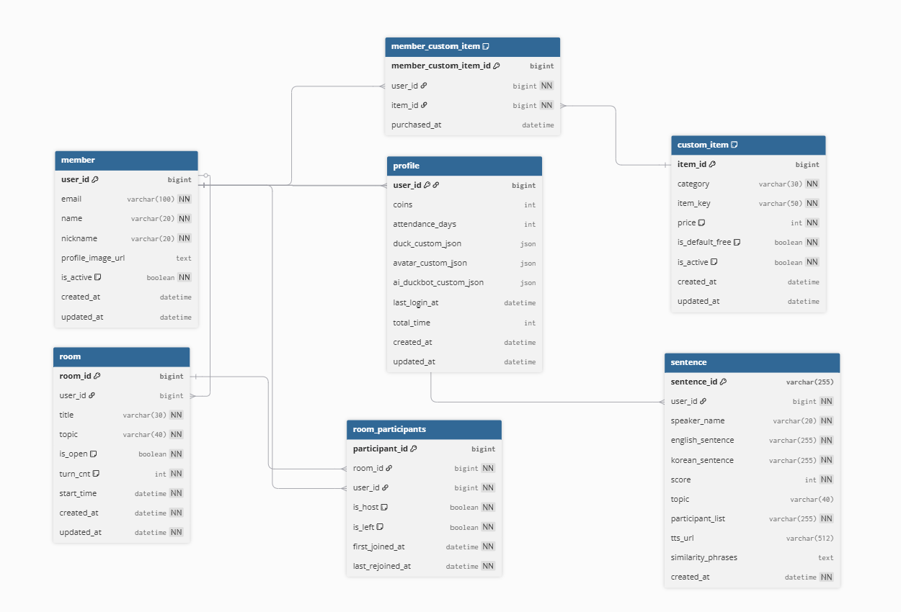

  Database ERD – 관계형 데이터 모델링 구조

  

---

## 🏗 System Architecture

  

  OpenVidu 기반 실시간 음성 처리 및 AI 파이프라인 아키텍처

  